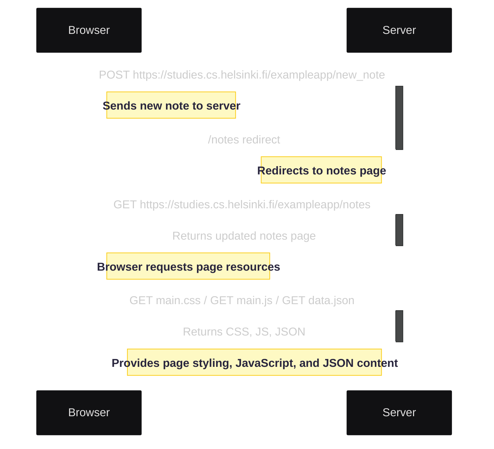

```mermaid
---
config:
  theme: redux-dark
---
sequenceDiagram
  participant Browser as Browser
  participant Server as Server

  Browser ->>+ Server: POST https://studies.cs.helsinki.fi/exampleapp/new_note
  note right of Browser: Sends new note to server
  Server -->>- Browser: /notes redirect
  note left of Server: Redirects to notes page

  Browser ->>+ Server: GET https://studies.cs.helsinki.fi/exampleapp/notes
  Server -->>- Browser: Returns updated notes page

  %% Grouping resource requests
  note right of Browser: Browser requests page resources
  Browser ->>+ Server: GET main.css / GET main.js / GET data.json
  Server -->>- Browser: Returns CSS, JS, JSON
  note left of Server: Provides page styling, JavaScript, and JSON content
```