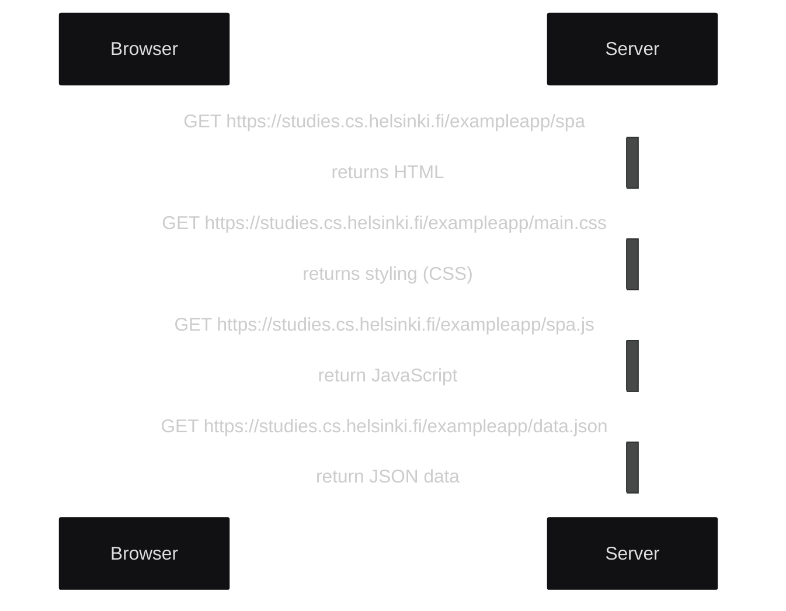

```mermaid
---
config:
  theme: redux-dark
---
sequenceDiagram
  participant Browser as Browser
  participant Server as Server

  Browser ->>+ Server: GET https://studies.cs.helsinki.fi/exampleapp/spa
  Server -->>- Browser: returns HTML

  Browser ->>+ Server: GET https://studies.cs.helsinki.fi/exampleapp/main.css
  Server -->>- Browser: returns styling (CSS)

  Browser ->>+ Server: GET https://studies.cs.helsinki.fi/exampleapp/spa.js
  Server -->>- Browser: return JavaScript

  Browser ->>+ Server: GET https://studies.cs.helsinki.fi/exampleapp/data.json
  Server -->>- Browser: return JSON data
```