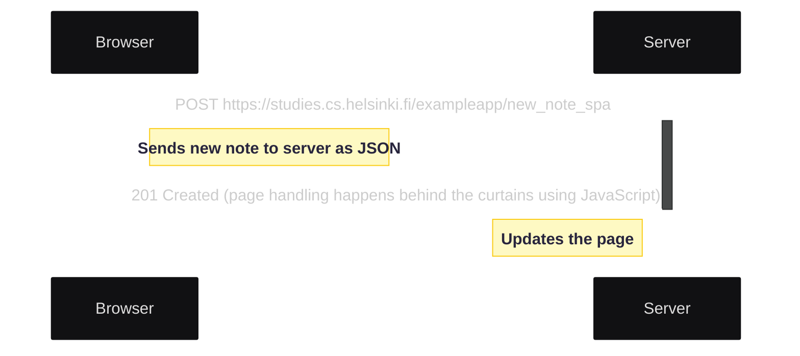

```mermaid
---
config:
  theme: redux-dark
---
sequenceDiagram
  participant Browser as Browser
  participant Server as Server

  Browser ->>+ Server: POST https://studies.cs.helsinki.fi/exampleapp/new_note_spa
  note right of Browser: Sends new note to server as JSON
  Server -->>- Browser: 201 Created (page handling happens behind the curtains using JavaScript)
  note left of Server: Updates the page
```